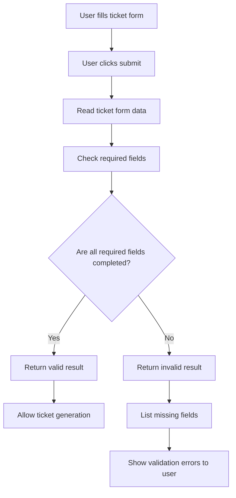

# Flow: Ticket Form Validation

## Purpose
This diagram shows the logic for validating required ticket fields before generating the final ticket.

## Logic summary
The validation logic checks whether all required fields contain real text. Empty values or values with only spaces are treated as missing. The function should not change the page directly. It should only return a validation result that can later be used by the user interface.
