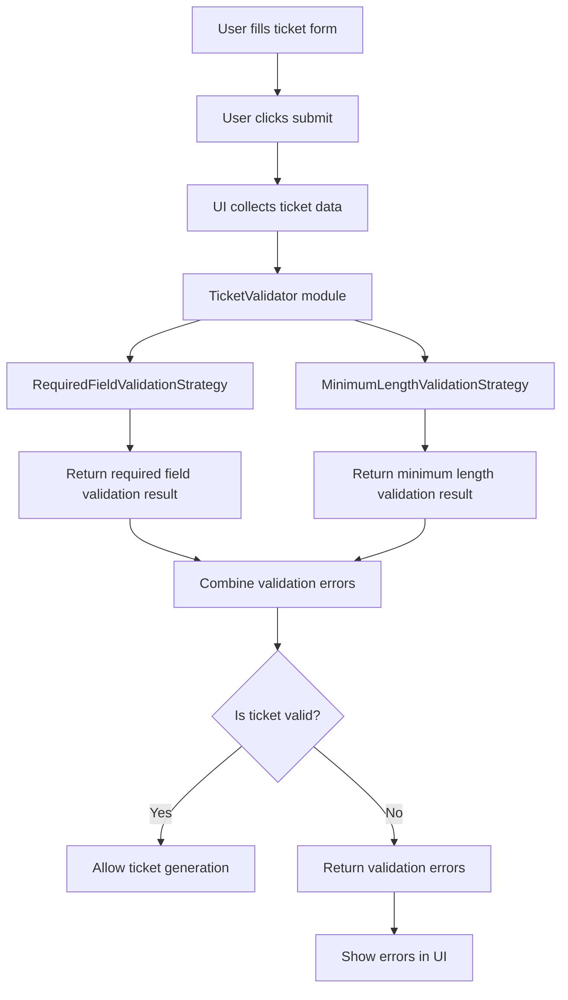

# Flow: Ticket Form Validation

## Purpose
This diagram shows the updated validation structure after implementing the Ticket Validation module with the Strategy Pattern.

## Logic summary
The UI does not perform validation directly. Instead, it sends ticket data to the TicketValidator module. The TicketValidator runs separate validation strategies and combines their results.

This structure follows the Strategy Pattern and keeps the validation logic modular.
